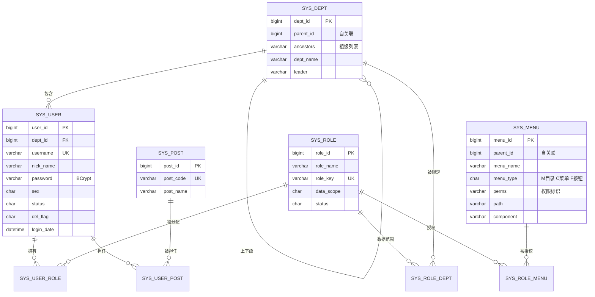
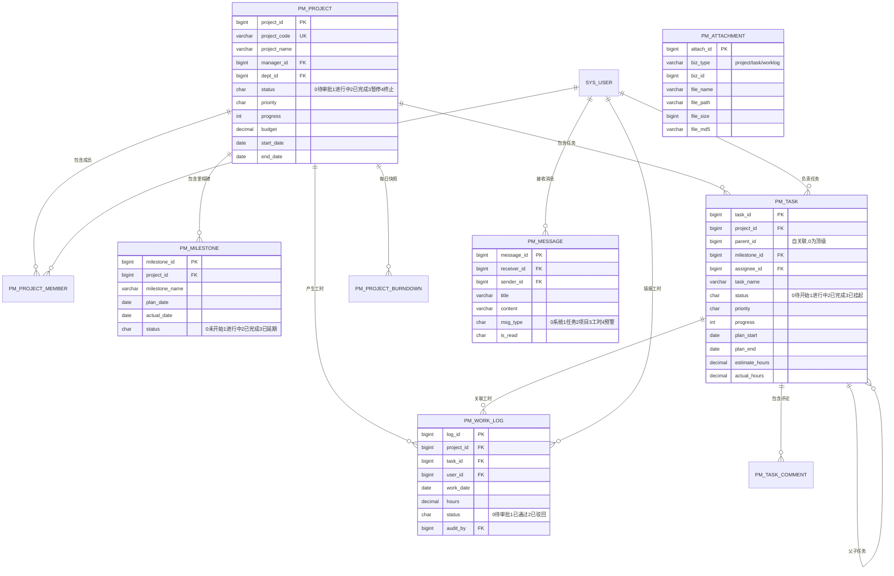

# 云协同 PMS 数据库设计文档

> 数据库：`biyesheji`　字符集：`utf8mb4` / `utf8mb4_general_ci`　引擎：`InnoDB`
> 表数量：23 张（系统域 14 张 + 业务域 9 张）

---

## 一、设计概述

### 1.1 设计原则

| 原则 | 说明 |
|---|---|
| 逻辑删除 | 业务表统一使用 `del_flag` 字段（`0` 存在 / `2` 删除），不做物理删除，便于数据追溯 |
| 审计字段 | 核心业务表带 `create_by` / `create_time` / `update_by` / `update_time`，由框架自动填充 |
| 命名规范 | 系统表前缀 `sys_`，业务表前缀 `pm_`；字段全小写下划线分隔 |
| 主键策略 | 统一 `BIGINT` 自增，便于分页与关联 |
| 关联表设计 | 多对多关系使用独立关联表（如 `sys_user_role`），只存两个外键，不设主键自增列 |
| 索引策略 | 外键字段、状态字段、时间字段建索引；业务唯一标识建唯一索引 |

### 1.2 表清单

**系统域（14 张）**

| 表名 | 说明 |
|---|---|
| `sys_user` | 用户表 |
| `sys_role` | 角色表 |
| `sys_menu` | 菜单权限表 |
| `sys_dept` | 部门表 |
| `sys_post` | 岗位表 |
| `sys_user_role` | 用户-角色关联 |
| `sys_user_post` | 用户-岗位关联 |
| `sys_role_menu` | 角色-菜单关联 |
| `sys_role_dept` | 角色-部门关联（数据权限用） |
| `sys_dict_type` | 字典类型 |
| `sys_dict_data` | 字典数据 |
| `sys_config` | 参数配置 |
| `sys_oper_log` | 操作日志 |
| `sys_login_log` | 登录日志 |

**业务域（9 张）**

| 表名 | 说明 |
|---|---|
| `pm_project` | 项目表 |
| `pm_project_member` | 项目成员表 |
| `pm_milestone` | 里程碑表 |
| `pm_task` | 任务表 |
| `pm_task_comment` | 任务评论表 |
| `pm_work_log` | 工时表 |
| `pm_attachment` | 附件表 |
| `pm_message` | 消息通知表 |
| `pm_project_burndown` | 项目燃尽图快照表 |

---

## 二、E-R 图

### 2.1 系统域核心关系



### 2.2 业务域核心关系



> **说明**：`pm_attachment` 与 `pm_message` 采用 **业务类型 + 业务ID**（`biz_type` + `biz_id`）的通用关联方式，而不是为每种业务单独建关联表。好处是一张表支撑项目附件、任务附件、工时附件三类场景，扩展新业务时不需要改表结构。

---

## 三、表结构详细说明

### 3.1 系统域

#### 3.1.1 sys_user 用户表

| 字段 | 类型 | 允许空 | 默认 | 说明 |
|---|---|---|---|---|
| user_id | bigint | 否 | 自增 | 用户ID，主键 |
| dept_id | bigint | 是 | NULL | 所属部门ID |
| username | varchar(30) | 否 | — | 登录账号，唯一索引 |
| nick_name | varchar(30) | 否 | — | 用户昵称 |
| email | varchar(50) | 是 | '' | 邮箱 |
| phonenumber | varchar(11) | 是 | '' | 手机号 |
| sex | char(1) | 否 | '0' | 性别 0男 1女 2未知 |
| avatar | varchar(255) | 是 | '' | 头像地址 |
| password | varchar(100) | 否 | — | 密码（BCrypt 密文，含盐） |
| status | char(1) | 否 | '0' | 状态 0正常 1停用 |
| del_flag | char(1) | 否 | '0' | 删除标志 0存在 2删除 |
| login_ip | varchar(128) | 是 | '' | 最后登录IP |
| login_date | datetime | 是 | NULL | 最后登录时间 |
| create_by / create_time | bigint / datetime | 是 | NULL | 创建人 / 创建时间 |
| update_by / update_time | bigint / datetime | 是 | NULL | 更新人 / 更新时间 |
| remark | varchar(500) | 是 | NULL | 备注 |

**索引**：主键 `user_id`；唯一索引 `uk_user_username(username)`；普通索引 `idx_user_dept(dept_id)`

#### 3.1.2 sys_role 角色表

| 字段 | 类型 | 说明 |
|---|---|---|
| role_id | bigint | 角色ID，主键 |
| role_name | varchar(30) | 角色名称 |
| role_key | varchar(100) | 角色权限字符，唯一索引 |
| role_sort | int | 显示顺序 |
| data_scope | char(1) | 数据范围 **1全部 2本部门 3本部门及以下 4仅本人** |
| status | char(1) | 状态 0正常 1停用 |
| del_flag | char(1) | 删除标志 |
| 审计字段 | — | create_by / create_time / update_by / update_time |
| remark | varchar(500) | 备注 |

#### 3.1.3 sys_menu 菜单权限表

| 字段 | 类型 | 说明 |
|---|---|---|
| menu_id | bigint | 菜单ID，主键 |
| menu_name | varchar(50) | 菜单名称 |
| parent_id | bigint | 父菜单ID，0为顶级（自关联） |
| order_num | int | 显示顺序 |
| path | varchar(200) | 路由地址，如 `/system/user` |
| component | varchar(255) | 前端组件路径，如 `system/user/index`；目录为 `Layout` |
| menu_type | char(1) | **M目录 C菜单 F按钮** |
| visible | char(1) | 显示状态 0显示 1隐藏 |
| status | char(1) | 菜单状态 0正常 1停用 |
| perms | varchar(100) | 权限标识，如 `system:user:list` |
| icon | varchar(100) | 菜单图标（Element Plus 图标名） |
| is_cache | char(1) | 是否缓存 0缓存 1不缓存 |

**设计要点**：菜单表同时承担「导航结构」与「权限标识」两个职责。前端凭 `path` + `component` 动态生成路由，后端凭 `perms` 做接口级鉴权（`@PreAuthorize("hasAuthority('xxx')")`）。

#### 3.1.4 sys_dept 部门表

| 字段 | 类型 | 说明 |
|---|---|---|
| dept_id | bigint | 部门ID，主键 |
| parent_id | bigint | 父部门ID，0为顶级（自关联） |
| **ancestors** | varchar(255) | **祖级列表**，如 `0,100,101`，用于快速查询所有下级 |
| dept_name | varchar(50) | 部门名称 |
| order_num | int | 显示顺序 |
| leader / phone / email | varchar | 负责人 / 联系电话 / 邮箱 |
| status | char(1) | 状态 |

**设计要点**：`ancestors` 字段是树形结构的**空间换时间**优化。查询某部门的所有下级时，只需 `WHERE FIND_IN_SET(dept_id, ancestors)`，避免递归查询数据库。

#### 3.1.5 关联表

| 表名 | 字段 | 说明 |
|---|---|---|
| `sys_user_role` | user_id, role_id | 联合主键，用户与角色的多对多 |
| `sys_user_post` | user_id, post_id | 用户与岗位的多对多 |
| `sys_role_menu` | role_id, menu_id | 角色与菜单的多对多（授权关系） |
| `sys_role_dept` | role_id, dept_id | 角色与部门的多对多（数据权限范围） |

#### 3.1.6 sys_dict_type / sys_dict_data 字典表

**sys_dict_type**：`dict_id` / `dict_name` / `dict_type`（唯一）/ `status` / `remark`
**sys_dict_data**：`dict_code` / `dict_sort` / `dict_label` / `dict_value` / `dict_type` / `list_class`（回显样式）/ `is_default` / `status`

**设计要点**：字典表把"枚举值"从代码里抽到数据库中，前端下拉框、状态标签都从字典接口取。修改选项不需要改代码重新发布。

#### 3.1.7 sys_config 参数配置表

`config_id` / `config_name` / `config_key`（唯一）/ `config_value` / `config_type`（是否系统内置）/ `remark`

**设计要点**：读取走 Redis 缓存（`SysConfigServiceImpl.selectValueByKey`），修改后主动清缓存，避免每次业务读取都打库。

#### 3.1.8 sys_oper_log 操作日志表

| 字段 | 类型 | 说明 |
|---|---|---|
| oper_id | bigint | 日志主键 |
| title | varchar(50) | 模块标题，如「用户管理」 |
| business_type | int | 业务类型 0其它 1新增 2修改 3删除 4导出 5导入 |
| method | varchar(200) | 目标方法全名 |
| request_method | varchar(10) | 请求方式 GET/POST/PUT/DELETE |
| oper_name | varchar(50) | 操作人员账号 |
| oper_url | varchar(255) | 请求URL |
| oper_ip | varchar(128) | 操作IP |
| oper_param | varchar(2000) | 请求参数（密码字段自动脱敏为 `******`） |
| json_result | varchar(2000) | 返回结果 |
| status | int | 0正常 1异常 |
| error_msg | varchar(2000) | 错误消息 |
| cost_time | bigint | 消耗时间(毫秒) |
| oper_time | datetime | 操作时间 |

**设计要点**：通过 AOP 切面 + `@Log` 注解自动记录，业务代码零侵入。**查询接口不加注解**（避免日志爆炸），只有增删改导出记录。

#### 3.1.9 sys_login_log 登录日志表

`info_id` / `username` / `ipaddr` / `browser` / `os` / `status`（0成功 1失败）/ `msg` / `login_time`

**设计要点**：登录成功与失败都记录，失败原因写入 `msg`（如「验证码错误」）。可用于排查暴力破解。

---

### 3.2 业务域

#### 3.2.1 pm_project 项目表

| 字段 | 类型 | 说明 |
|---|---|---|
| project_id | bigint | 项目ID，主键 |
| project_code | varchar(50) | 项目编号，唯一索引 |
| project_name | varchar(100) | 项目名称 |
| manager_id | bigint | 项目经理ID |
| dept_id | bigint | 所属部门ID |
| description | text | 项目描述 |
| priority | char(1) | 优先级 1高 2中 3低 |
| status | char(1) | **0待审批 1进行中 2已完成 3已暂停 4已终止** |
| progress | int | 进度百分比（由任务完成情况自动计算） |
| budget | decimal(14,2) | 项目预算 |
| start_date / end_date | date | 计划起止日期 |
| actual_end | date | 实际结束日期 |
| del_flag | char(1) | 删除标志 |
| 审计字段 + remark | — | — |

**索引**：`uk_project_code` / `idx_pj_status` / `idx_pj_manager`

**进度自动计算规则**：`progress = 已完成任务数 / 任务总数 × 100`，由 `PmProjectServiceImpl.recalcProgress()` 在任务增删改时触发。

#### 3.2.2 pm_project_member 项目成员表

| 字段 | 说明 |
|---|---|
| id | 主键 |
| project_id | 项目ID |
| user_id | 用户ID |
| role_in_pj | 项目内角色（如「项目经理」「后端开发」） |
| join_time | 加入时间 |

**索引**：唯一索引 `uk_pm_project_user(project_id, user_id)` 防止重复加入。

**设计要点**：项目成员表是"数据隔离"的落脚点 —— 非管理员用户查询项目列表时，通过 `selectProjectIdsByUserId` 限定范围。

#### 3.2.3 pm_milestone 里程碑表

`milestone_id` / `project_id` / `milestone_name` / `plan_date` / `actual_date` / `status`（0未开始 1进行中 2已完成 3已延期）/ `order_num`

#### 3.2.4 pm_task 任务表

| 字段 | 类型 | 说明 |
|---|---|---|
| task_id | bigint | 任务ID，主键 |
| project_id | bigint | 所属项目 |
| **parent_id** | bigint | **父任务ID，0为顶级**（自关联，支持任务拆解） |
| milestone_id | bigint | 所属里程碑 |
| task_name | varchar(200) | 任务名称 |
| assignee_id | bigint | 负责人ID |
| priority | char(1) | 优先级 1高 2中 3低 |
| status | char(1) | **0待开始 1进行中 2已完成 3已挂起** |
| progress | int | 进度百分比 |
| plan_start / plan_end | date | 计划起止日期 |
| actual_end | date | 实际完成日期 |
| estimate_hours | decimal(8,2) | 预估工时 |
| actual_hours | decimal(8,2) | 实际工时 |
| order_num | int | 排序号（看板拖拽用） |

**索引**：`idx_tk_project` / `idx_tk_assignee` / `idx_tk_status`

**逾期判定**：`plan_end < 当前日期 且 status != '2'`，由 SQL 计算返回 `overdue` 标记。

#### 3.2.5 pm_task_comment 任务评论表

`comment_id` / `task_id` / `user_id` / `content` / `del_flag` / `create_time`

#### 3.2.6 pm_work_log 工时表

| 字段 | 类型 | 说明 |
|---|---|---|
| log_id | bigint | 工时ID，主键 |
| project_id | bigint | 项目ID |
| task_id | bigint | 任务ID（可空） |
| user_id | bigint | 填报人 |
| work_date | date | 工作日期 |
| hours | decimal(5,2) | 工时数 |
| content | varchar(500) | 工作内容 |
| status | char(1) | **0待审批 1已通过 2已驳回** |
| audit_by | bigint | 审批人 |
| audit_time | datetime | 审批时间 |
| audit_remark | varchar(500) | 审批意见 |

**索引**：`idx_wl_project` / `idx_wl_user_date(user_id, work_date)`（加速「某人某天工时合计」的校验查询）

**业务约束**：单日累计填报不超过 24 小时；只有「待审批」状态可修改删除；已通过状态仅管理员可删。

> **注意**：该表没有 `create_by` / `update_by` 列，因此**不继承 BaseEntity**，避免 ORM 映射到不存在的列。同类情况还有 `pm_attachment`、`pm_message`、`pm_project_burndown`。

#### 3.2.7 pm_attachment 附件表

| 字段 | 说明 |
|---|---|
| attach_id | 主键 |
| biz_type | 业务类型：`project` / `task` / `worklog` |
| biz_id | 业务ID |
| file_name | 原始文件名 |
| file_path | 存储相对路径，如 `project/2026/09/15/{uuid}.pdf` |
| file_suffix | 扩展名 |
| file_size | 文件大小(字节) |
| **file_md5** | 文件摘要，用于秒传与去重 |
| upload_by | 上传人 |

**索引**：`idx_at_biz(biz_type, biz_id)` / `idx_at_md5(file_md5)`

#### 3.2.8 pm_message 消息通知表

`message_id` / `receiver_id` / `sender_id` / `title` / `content` / `msg_type`（0系统 1任务 2项目 3工时 4预警）/ `biz_type` / `biz_id` / `is_read` / `read_time`

**索引**：`idx_mg_receiver(receiver_id, is_read)` —— 直接服务「未读消息数」这个高频查询。

#### 3.2.9 pm_project_burndown 燃尽图快照表

| 字段 | 说明 |
|---|---|
| snapshot_id | 主键 |
| project_id | 项目ID |
| snapshot_date | 快照日期 |
| total_hours | 总预估工时 |
| remaining_hours | 剩余工时（未完成任务的预估工时之和） |
| completed_hours | 已完成工时 |

**索引**：唯一索引 `uk_bd_project_date(project_id, snapshot_date)` 保证每天每个项目只有一条快照，重复执行定时任务时先删后插保证幂等。

**设计要点**：燃尽图数据必须**按天快照**，不能实时计算 —— 因为任务的预估工时会被修改，实时算会导致历史趋势线被"篡改"，画出来的燃尽图失去意义。

---

## 四、核心业务流转

### 4.1 项目状态流转

```
待审批(0) ──> 进行中(1) ──> 已完成(2)
                  │
                  ├──> 已暂停(3) ──> 进行中(1)
                  └──> 已终止(4)
```

进度到达 100%（所有任务完成）时自动流转为「已完成」并写入实际结束日期。

### 4.2 任务状态流转

```
待开始(0) ──> 进行中(1) ──> 已完成(2)
                  │
                  └──> 已挂起(3) ──> 进行中(1)
```

任务状态变更后触发项目进度重算，实现「任务驱动项目进度」。

### 4.3 工时审批流转

```
待审批(0) ──通过──> 已通过(1)   ← 计入统计与绩效
           └─驳回──> 已驳回(2)   ← 可修改后重新提交为待审批
```

---

## 五、关键设计取舍说明

| 设计点 | 选择 | 原因 |
|---|---|---|
| 逻辑删除 vs 物理删除 | 逻辑删除 | 数据可追溯，误删可恢复 |
| 树形结构存储 | `parent_id` + `ancestors` | 避免递归查询，一次 SQL 取出整棵树 |
| 权限模型 | RBAC（用户-角色-菜单） | 角色变更即时生效，不需要逐个用户配权限 |
| 附件关联方式 | `biz_type` + `biz_id` 通用关联 | 一张表支撑多种业务，扩展不需要改表 |
| 燃尽图数据 | 每日快照表 | 避免预估工时被修改导致历史曲线失真 |
| 前端路由来源 | 后端菜单动态下发 | 菜单调整不需要改前端代码重新发布 |
| 密码存储 | BCrypt（自带随机盐） | 抗彩虹表，同一密码每次密文不同 |
| 令牌方案 | JWT + Redis | JWT 无状态便于扩展，Redis 支持主动注销与滑动续期 |
